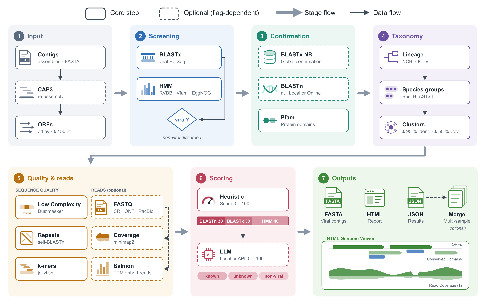

::: {.lead}
Open-source software developed in the laboratory to find, classify and
interpret viruses in sequencing data. Pick a tool and step through the
analysis.
:::

<!-- English version of ferramentas.qmd. Keep the tool ids identical in both
     languages so links such as tools.html#vapor keep working. -->

```{=html}
<div class="tools" data-tools data-label-steps="steps" data-label-progs="programs">

  <div class="tool-picker" role="tablist" aria-label="Tools">
    <button class="tool-pick" type="button" role="tab" id="tab-viralquest"
            aria-controls="viralquest" data-tool="viralquest"
            style="--tool-accent:#3f7bc4">
      
      <span class="tool-pick-kind">Tool · Python</span>
      <span class="tool-pick-desc">Virus discovery in genetic data, with an interactive report</span>
    </button>
    <button class="tool-pick" type="button" role="tab" id="tab-vapor"
            aria-controls="vapor" data-tool="vapor"
            style="--tool-accent:#14b8a6">
      
      <span class="tool-pick-kind">Pipeline · Snakemake</span>
      <span class="tool-pick-desc">Viral and prokaryotic metagenomics, from reads to reports</span>
    </button>
    <button class="tool-pick" type="button" role="tab" id="tab-viralfetch"
            aria-controls="viralfetch" data-tool="viralfetch"
            style="--tool-accent:#7c3aed">
      
      <span class="tool-pick-kind">Tool · Python · CLI</span>
      <span class="tool-pick-desc">Virus taxonomy, metadata, sequences and trees from the terminal</span>
    </button>
  </div>

  <!-- ============================================================ ViralQuest -->
  <section class="tool-panel" id="viralquest" role="tabpanel" aria-labelledby="tab-viralquest"
           style="--tool-accent:#3f7bc4; --tool-accent-dark:#04337e">

    <header class="tool-head">
      <div>
        <p class="eyebrow">Tool · Open source · Free</p>
        <h2 class="tool-name">ViralQuest</h2>
        <p class="tool-tagline">Finding viruses hidden in genetic data</p>
      </div>
      <div class="tool-actions">
        <a class="btn-biovir" href="https://github.com/gabrielvpina/viralquest">GitHub</a>
        <a class="btn-biovir-ghost" href="https://doi.org/10.1186/s12859-026-06391-6">Paper · BMC Bioinformatics</a>
      </div>
    </header>

    <div class="tool-intro">
      <p>Viruses are everywhere: in plants, animals, people and the environment.
      Yet most of them are still unknown. Scientists can now read, all at
      once, the genetic material of an entire sample, such as a leaf, an
      insect or a soil sample. Among millions of sequences, one question
      remains hard to answer: <strong>which of them belong to
      viruses?</strong></p>
      <p>ViralQuest was built to answer that question. It is free,
      open-source software developed at BioVirLab, and its results have been
      published in an international scientific journal.</p>
    </div>

    <h3 class="tool-section">How it works <span class="tool-count" data-count></span></h3>

    <div class="flow" data-flow>
      <ol class="flow-steps">
        <li><button type="button" class="flow-step"><span class="flow-num">01</span><span class="flow-label">Sample</span></button></li>
        <li><button type="button" class="flow-step"><span class="flow-num">02</span><span class="flow-label">Search</span></button></li>
        <li><button type="button" class="flow-step"><span class="flow-num">03</span><span class="flow-label">Comparison</span></button></li>
        <li><button type="button" class="flow-step"><span class="flow-num">04</span><span class="flow-label">Classification</span></button></li>
        <li><button type="button" class="flow-step"><span class="flow-num">05</span><span class="flow-label">Report</span></button></li>
      </ol>
      <div class="flow-details">
        <div class="flow-detail">
          <h4>Millions of sequences from a whole sample</h4>
          <p>The starting point is the genetic material read from an entire
          sample — a leaf, an insect, some soil — with sequences from every
          organism in it mixed together.</p>
        </div>
        <div class="flow-detail">
          <h4>Searching the data for viruses</h4>
          <p>ViralQuest sifts through large volumes of genetic data and finds
          virus sequences, including those of viruses not yet described.</p>
        </div>
        <div class="flow-detail">
          <h4>Comparison against international databases</h4>
          <p>The sequences found are compared against large international
          reference databases.</p>
        </div>
        <div class="flow-detail">
          <h4>Viral group and genes</h4>
          <p>For each virus, the tool indicates which group it most likely
          belongs to and which genes it carries.</p>
        </div>
        <div class="flow-detail">
          <h4>Interactive report in the browser</h4>
          <p>At the end of the analysis, ViralQuest produces a report that
          opens in any web browser, making results easy to interpret and
          share.</p>
          <ul class="flow-chips flow-chips-plain">
            <li>charts</li>
            <li>viral genome maps</li>
            <li>organized tables</li>
          </ul>
        </div>
      </div>
    </div>

    <h3 class="tool-section">Pipeline overview</h3>
    <figure class="tool-figure">
      <a href="../assets/viralquest-scheme.png" target="_blank" rel="noopener">
        
      </a>
      <figcaption>ViralQuest's seven stages, from input contigs to the report. Dashed boxes are optional steps. Click to enlarge.</figcaption>
    </figure>

    <h3 class="tool-section">What it is for</h3>
    <div class="card-grid tool-cards">
      <div class="info-card"><h3>Discover new viruses</h3><p>In different organisms and environments.</p></div>
      <div class="info-card"><h3>Understand viral diversity</h3><p>See which viruses are present in a sample.</p></div>
      <div class="info-card"><h3>Speed up research</h3><p>In health, agriculture and the environment, turning raw data into useful information.</p></div>
    </div>
  </section>

  <!-- ================================================================= VAPOR -->
  <section class="tool-panel" id="vapor" role="tabpanel" aria-labelledby="tab-vapor"
           style="--tool-accent:#14b8a6; --tool-accent-dark:#0f766e">

    <header class="tool-head">
      <div>
        <p class="eyebrow">Pipeline · Snakemake · Open source</p>
        <h2 class="tool-name">VAPOR</h2>
        <p class="tool-tagline">Viral And Prokaryotic mOdular pipelineR</p>
      </div>
      <div class="tool-actions">
        <a class="btn-biovir" href="https://github.com/LymF/vapor">GitHub</a>
      </div>
    </header>

    <div class="tool-intro">
      <p>VAPOR is a Snakemake pipeline that takes metagenomic sequencing reads —
      short (Illumina, paired or single-end) or long (Nanopore and PacBio
      HiFi) — and automatically runs a series of analyses, configured by
      <strong>a single parameter file</strong>.</p>
    </div>

    <h3 class="tool-section">Pipeline stages <span class="tool-count" data-count></span></h3>

    <div class="flow" data-flow>
      <div class="reads-toggle" data-reads-toggle role="group" aria-label="Read type">
        <span class="reads-toggle-label">Highlight programs for</span>
        <button type="button" data-reads="all" aria-pressed="true">All</button>
        <button type="button" data-reads="short" aria-pressed="false">Short reads</button>
        <button type="button" data-reads="long" aria-pressed="false">Long reads</button>
      </div>
      <ol class="flow-steps">
        <li><button type="button" class="flow-step"><span class="flow-num">01</span><span class="flow-label">Quality</span></button></li>
        <li><button type="button" class="flow-step"><span class="flow-num">02</span><span class="flow-label">Assembly</span></button></li>
        <li><button type="button" class="flow-step"><span class="flow-num">03</span><span class="flow-label">Viruses</span></button></li>
        <li><button type="button" class="flow-step"><span class="flow-num">04</span><span class="flow-label">Prokaryotes</span></button></li>
        <li><button type="button" class="flow-step"><span class="flow-num">05</span><span class="flow-label">Annotation</span></button></li>
        <li><button type="button" class="flow-step"><span class="flow-num">06</span><span class="flow-label">Abundance</span></button></li>
      </ol>
      <div class="flow-details">
        <div class="flow-detail">
          <h4>Read quality control</h4>
          <p>Reads are cleaned and assessed before any further analysis.</p>
          <ul class="flow-chips">
            <li data-reads="short">fastp</li>
            <li data-reads="long">NanoPlot</li>
            <li data-reads="long">Porechop</li>
            <li data-reads="long">Filtlong</li>
          </ul>
        </div>
        <div class="flow-detail">
          <h4>Assembly into contigs</h4>
          <p>MEGAHIT for short reads; Flye with Medaka, or metaMDBG, for long
          reads. Assemblies are evaluated with QUAST. An optional module
          classifies reads directly, without assembly.</p>
          <ul class="flow-chips">
            <li data-reads="short">MEGAHIT</li>
            <li data-reads="long">Flye</li>
            <li data-reads="long">Medaka</li>
            <li data-reads="long">metaMDBG</li>
            <li>QUAST</li>
            <li class="is-optional">Sylph</li>
          </ul>
        </div>
        <div class="flow-detail">
          <h4>Viral branch</h4>
          <p>Detects viral contigs, assesses completeness, excises proviruses,
          bins contigs into genomes and builds a vOTU catalogue, clustering
          viruses from all samples by similarity.</p>
          <ul class="flow-chips">
            <li>VirSorter2</li>
            <li>geNomad</li>
            <li>CheckV</li>
            <li>vRhyme</li>
            <li>skani</li>
          </ul>
        </div>
        <div class="flow-detail">
          <h4>Prokaryotic branch</h4>
          <p>Reconstructs genomes with several binners, picks the best bins,
          checks quality and contamination, removes redundancy and classifies
          them.</p>
          <ul class="flow-chips">
            <li>MetaBAT2</li>
            <li>VAMB</li>
            <li>SemiBin2</li>
            <li>Binette</li>
            <li>CheckM2</li>
            <li>GUNC</li>
            <li>GTDB-Tk</li>
          </ul>
        </div>
        <div class="flow-detail">
          <h4>Taxonomy, hosts and annotation</h4>
          <p>Viral taxonomy against INPHARED, host prediction, screening for
          antibiotic resistance genes and defence systems, and functional
          annotation.</p>
          <ul class="flow-chips">
            <li>MMseqs2</li>
            <li>PHIST</li>
            <li>AMRFinderPlus</li>
            <li>RGI</li>
            <li>DefenseFinder</li>
            <li>Pharokka</li>
            <li>Phold</li>
            <li>Bakta</li>
            <li>EggNOG</li>
          </ul>
        </div>
        <div class="flow-detail">
          <h4>Abundance and diversity</h4>
          <p>Per-sample abundance and alpha and beta diversity metrics.</p>
          <ul class="flow-chips">
            <li>CoverM</li>
          </ul>
        </div>
      </div>
      <p class="flow-legend"><span class="flow-legend-opt">optional</span> module that can be switched on in the parameter file</p>
    </div>

    <h3 class="tool-section">Outputs</h3>
    <div class="card-grid tool-cards">
      <div class="info-card"><h3>Genomes</h3><p>Organized viral and prokaryotic genomes, with circular maps.</p></div>
      <div class="info-card"><h3>Tables</h3><p>Taxonomy, quality, hosts, resistance and defence genes.</p></div>
      <div class="info-card"><h3>Matrices and diversity</h3><p>Per-sample presence and abundance; alpha and beta diversity.</p></div>
      <div class="info-card"><h3>Reports</h3><p>A MultiQC report and an interactive HTML report bringing it all together.</p></div>
    </div>
  </section>

  <!-- ============================================================ viralfetch -->
  <section class="tool-panel" id="viralfetch" role="tabpanel" aria-labelledby="tab-viralfetch"
           style="--tool-accent:#7c3aed; --tool-accent-dark:#1e1b4b; --tool-accent-soft:#c4b5fd; --tool-term-bg:#1e1b4b">

    <header class="tool-head">
      <div>
        <p class="eyebrow">Tool · Command line · Open source</p>
        <h2 class="tool-name">viralfetch</h2>
        <p class="tool-tagline">Virus taxonomy, metadata and sequences, from the terminal</p>
      </div>
      <div class="tool-actions">
        <a class="btn-biovir" href="https://github.com/gabrielvpina/viralfetch">GitHub</a>
        <a class="btn-biovir-ghost" href="https://pypi.org/project/viralfetch/">PyPI</a>
      </div>
    </header>

    <div class="tool-intro">
      <p>viralfetch is a command-line tool for querying and downloading viral
      taxonomy, metadata, sequences, and the per-family phylogenetic trees and
      alignments. A virus name is enough: the tool finds its lineage, its
      GenBank/RefSeq accessions and the related data, <strong>combining four
      sources</strong> in a single query.</p>
      <p>Every output is also available as <code>--json</code>, ready for
      scripts and <code>jq</code>; downloaded data is cached, and names the
      local index does not know are looked up in NCBI taxonomy.</p>
    </div>

    <div class="tool-install">
      <span class="tool-install-label">Installation</span>
      <code>pip install viralfetch</code>
    </div>

    <h3 class="tool-section">Commands <span class="tool-count" data-count data-label-steps="commands"></span></h3>

    <div class="flow" data-flow>
      <ol class="flow-steps">
        <li><button type="button" class="flow-step"><span class="flow-num">01</span><span class="flow-label">tax</span></button></li>
        <li><button type="button" class="flow-step"><span class="flow-num">02</span><span class="flow-label">members</span></button></li>
        <li><button type="button" class="flow-step"><span class="flow-num">03</span><span class="flow-label">seq</span></button></li>
        <li><button type="button" class="flow-step"><span class="flow-num">04</span><span class="flow-label">text</span></button></li>
        <li><button type="button" class="flow-step"><span class="flow-num">05</span><span class="flow-label">tree</span></button></li>
        <li><button type="button" class="flow-step"><span class="flow-num">06</span><span class="flow-label">msa</span></button></li>
      </ol>
      <div class="flow-details">
        <div class="flow-detail">
          <h4><code class="flow-cmd">viralfetch tax</code> Taxonomic lineage</h4>
          <p>Shows the full ICTV lineage (realm to species). It can also query NCBI taxonomy directly, or compare both side by side, highlighting where they diverge.</p>
          <ul class="flow-chips flow-chips-flags">
            <li>--ncbi</li>
            <li>--compare-ncbi</li>
          </ul>
          <pre class="flow-term"><code>$ viralfetch tax Coronaviridae
╭─ Coronaviridae  (family) ──╮
│ realm     Riboviria        │
│ kingdom   Orthornavirae    │
│ phylum    Pisuviricota     │
│ class     Pisoniviricetes  │
│ order     Nidovirales      │
│ suborder  Cornidovirineae  │
│ family    Coronaviridae  ◀ │
╰────────────────────────────╯</code></pre>
        </div>
        <div class="flow-detail">
          <h4><code class="flow-cmd">viralfetch members</code> Taxa below a group</h4>
          <p>Lists a group's taxa at a chosen rank, just the counts, or the full descendant tree.</p>
          <ul class="flow-chips flow-chips-flags">
            <li>--rank</li>
            <li>--count</li>
            <li>--tree</li>
          </ul>
          <pre class="flow-term"><code>$ viralfetch members Coronaviridae --rank genus
genera in family Coronaviridae
┏━━━━━━━━━━━━━━━━━━┳━━━━━━━━━┓
┃ genus            ┃ species ┃
┡━━━━━━━━━━━━━━━━━━╇━━━━━━━━━┩
│ Alphacoronavirus │      26 │
│ Alphaletovirus   │       1 │
│ Alphapironavirus │       1 │
│ Betacoronavirus  │      14 │
│ Deltacoronavirus │       7 │
│ Gammacoronavirus │       5 │
└──────────────────┴─────────┘
           6 genera</code></pre>
        </div>
        <div class="flow-detail">
          <h4><code class="flow-cmd">viralfetch seq</code> NCBI sequences</h4>
          <p>Resolves accessions locally from the VMR and fetches metadata, FASTA or GenBank records from NCBI. For a whole group, it first shows a local estimate of the download size.</p>
          <ul class="flow-chips flow-chips-flags">
            <li>--meta</li>
            <li>--fasta</li>
            <li>--gb</li>
            <li>--taxon</li>
            <li>--protein</li>
          </ul>
          <pre class="flow-term"><code>$ viralfetch seq &quot;Betacoronavirus pandemicum&quot; --fasta -o out.fa
Wrote 4 fasta record(s) for Betacoronavirus pandemicum to out.fa

$ viralfetch seq --taxon Coronaviridae --meta
╭─ Coronaviridae (family) — download estimate ─╮
│ species     54                               │
│ isolates    59                               │
│ accessions  59                               │
╰──────────────────────────────────────────────╯</code></pre>
        </div>
        <div class="flow-detail">
          <h4><code class="flow-cmd">viralfetch text</code> ICTV Report chapter</h4>
          <p>Fetches the family's ICTV Report chapter as Markdown, with tables and italicised scientific names. Figures can be drawn right in the terminal.</p>
          <ul class="flow-chips flow-chips-flags">
            <li>--section</li>
            <li>--raw</li>
            <li>--images</li>
          </ul>
          <pre class="flow-term"><code>$ viralfetch text Coronaviridae --section summary
                  Family: Coronaviridae

Source: https://ictv.global/report/chapter/coronaviridae/coronaviridae
Content is licensed CC BY 4.0
──────────────────────────────────────────────────────
Summary

Members of the family Coronaviridae, a monophyletic group
of viruses in the order Nidovirales, are enveloped,
positive-sense RNA viruses …</code></pre>
        </div>
        <div class="flow-detail">
          <h4><code class="flow-cmd">viralfetch tree</code> Phylogenetic tree</h4>
          <p>Draws the family's phylogenetic tree, offline, highlighting the queried species or genus.</p>
          <ul class="flow-chips flow-chips-flags">
            <li>--tree N</li>
            <li>--newick</li>
            <li>--chapter</li>
          </ul>
          <pre class="flow-term"><code>$ viralfetch tree &quot;Betacoronavirus pandemicum&quot;
Coronaviridae · Figure 5A · RdRp (AA) · 55 tips · 2 matches
     ┌─ Alphacoronavirus BT020
   ┌─┤
   │ └─ Scotophilus bat coronavirus 512
  ─┤          …
   │     ┌ severe acute respiratory syndrome coronavirus  ← match
   └─────┤
         └ severe acute respiratory syndrome coronavirus 2  ← match</code></pre>
        </div>
        <div class="flow-detail">
          <h4><code class="flow-cmd">viralfetch msa</code> Multiple sequence alignment</h4>
          <p>Shows the alignment behind the tree, coloured by residue, with the queried sequence marked. Exports the alignment as FASTA.</p>
          <ul class="flow-chips flow-chips-flags">
            <li>--range</li>
            <li>--consensus</li>
            <li>--fasta</li>
          </ul>
          <pre class="flow-term"><code>$ viralfetch msa &quot;Betacoronavirus pandemicum&quot; --consensus
Coronaviridae · tree1 · AA · cols 1–60 of 316 · 55 seqs
consensus              KHFFFAQDGDAAITDYDYYRYNRPTMLDICQALFVYEVVDKYFD
▶ severe acute respir  KHFFFAQDGNAAISDYDYYRYNLPTMCDIRQLLFVVEVVDKYFD
Alphapironavirus bona  EHFFYLQPRDCAVTDFDYYRFNRPTVLDPLQFRFVYNVVKHYFK
…                      0^                 20^                 40^</code></pre>
        </div>
      </div>
    </div>

    <h3 class="tool-section">Data sources</h3>
    <div class="card-grid tool-cards">
      <div class="info-card"><span class="source-tag source-local">local</span><h3>ICTV VMR</h3><p>Taxonomic hierarchy, exemplar isolates and GenBank/RefSeq accessions. The local index, embedded in the package.</p></div>
      <div class="info-card"><span class="source-tag source-remote">remote</span><h3>NCBI E-utilities</h3><p>Sequence metadata, nucleotide and protein sequences and NCBI taxonomy, fetched on demand.</p></div>
      <div class="info-card"><span class="source-tag source-remote">remote</span><h3>ICTV Report</h3><p>The descriptive chapter text for each family, with figures.</p></div>
      <div class="info-card"><span class="source-tag source-local">local</span><h3>ICTV Report trees</h3><p>Per-family Newick trees and amino-acid and nucleotide alignments, bundled with the package.</p></div>
    </div>
  </section>

</div>
<script src="../js/ferramentas.js"></script>
```
