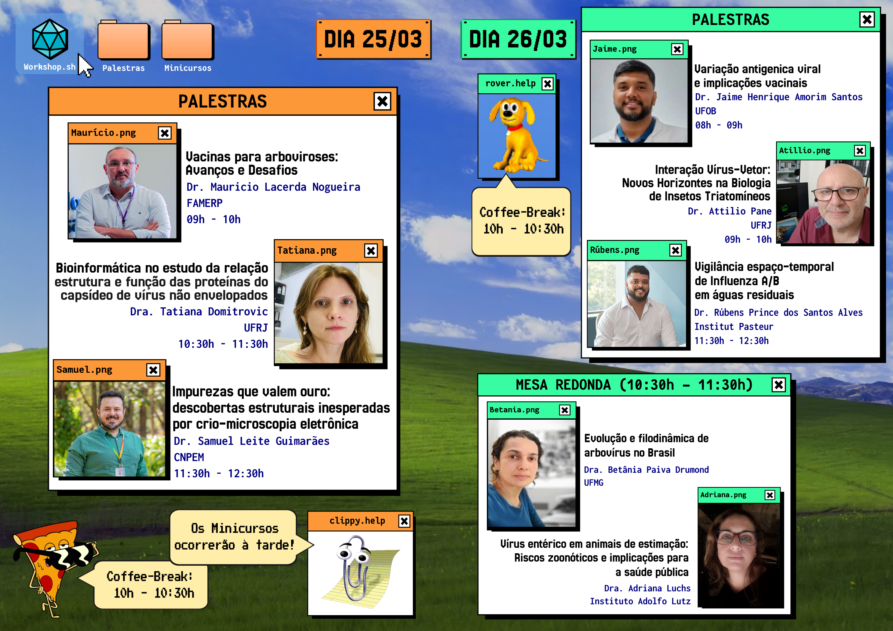
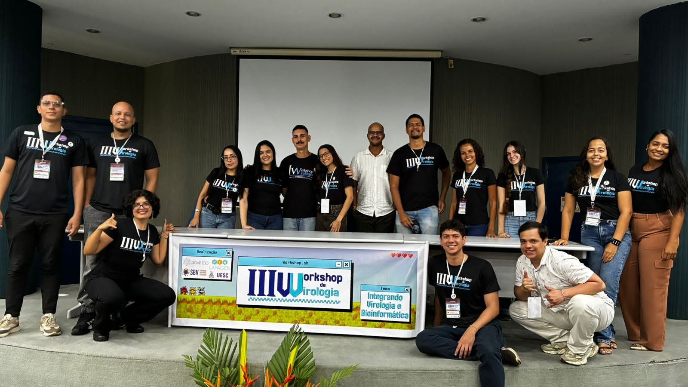

The Virology Workshop is an outreach initiative held annually at the State
University of Santa Cruz (UESC), the result of a partnership between the Virus
Bioinformatics Laboratory (BioVirLab) and the Applied Pathology and Genetics
Laboratory (LAPAGEN), with support from the Brazilian Society of Virology (SBV).

In its third edition, under the theme "Virology and Bioinformatics", the
workshop brought together prominent scientists from across the field, from
environmental to human virology, including Betânia Drumond, the current
president of the SBV. That breadth helped bring current, high-quality knowledge
to an academic community made up of research lecturers, professionals and
students in training.

Topics such as the advances and challenges of dengue vaccine development, along
with different methodological approaches to the study of viruses — cryo-electron
microscopy and, fittingly for this year's theme, bioinformatics — give the event
an interdisciplinary identity of its own. The programme mixed a wide range of
subjects, from basic science through to more technical approaches.

Epidemiology, surveillance and viral evolution also stood out as central themes
in the talks and in the round table, prompting substantial discussion of how
viruses adapt. These debates raised important reflections on the current
landscape, and on the precautionary measures that should be adopted and
monitored in the face of the outlook and the risks to the population.

The speakers invited to this third edition came from institutions of considerable
standing in Brazilian and international science, including the Federal University
of Western Bahia (UFOB), the Federal University of Rio de Janeiro (UFRJ), the
Federal University of Minas Gerais (UFMG), the São José do Rio Preto Medical
School (FAMERP), the Brazilian Center for Research in Energy and Materials
(CNPEM), the Institut Pasteur and the Adolfo Lutz Institute. This institutional
diversity reinforces the broad, integrative character of the event, encouraging
the exchange of experience, knowledge and different perspectives within virology.

In this context, the workshop is establishing itself as an important influence on
the training of new scientists, on strengthening virology in the Northeast of
Brazil, and on bringing teaching institutions closer together. That interaction
was helped in particular by the presence of attendees and speakers from a range
of universities and institutions, opening the way for new academic ties and
scientific collaborations.
